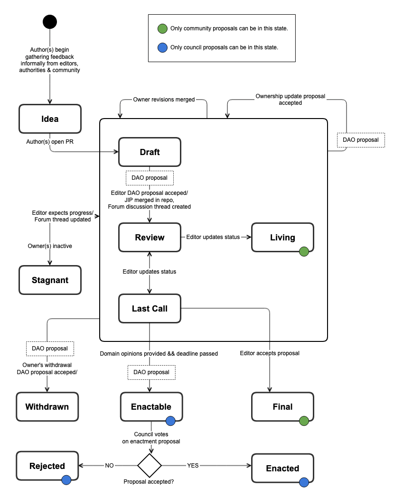

# 🤚 Joystream Improvement Proposals

## Introduction

The Joystream Improvement Proposal (JIP) process concerns it self with how to document, propose and update standards in the Joystream Network. By standards one intends to refer very broadly to all protocols, formats, processes or policies involved in coordinating activity among participants in the Joystream project.&#x20;

The JIP process is heavily inspired by the Bitcoin Improvement Proposal ([BIP](https://github.com/bitcoin/bips)) and Ethereum Improvement Proposal ([EIP](https://eips.ethereum.org/)) processes. The JIP process attempts to improve upon these earlier approaches by taking advantage of the inherent governance, [binding upgrades](https://docs.substrate.io/build/upgrade-the-runtime/), accountability and publishing capabilities of the Joystream blockchain and DAO. The aspiration is that this will help generated greater transparency and legitimacy for how changes are made, contributing to the pace of innovation and preservation of network effect by avoiding some of the prior challenges around [highly subjective rules](https://github.com/bitcoin/bips/blob/master/bip-0002.mediawiki#rationale), [arbitrary](https://eips.ethereum.org/EIPS/eip-1#eip-editors) [authorities](https://github.com/bitcoin/bips/blob/master/bip-0001.mediawiki#bip-editors) and [arbitrary venues](https://github.com/ethereum/EIPs/blob/master/EIPS/eip-1.md#core-eips).&#x20;

## Proposals

A Joystream Improvement Proposal (JIP) is a well specified and scope constrained initiative, or proposal, for a new standard that in some way improves the Joystream Network. Such proposals are managed through a process described herein, called the _JIP process_, and one of the important activities in this process is the preparation and maintenance of a _JIP document_ which encompasses the substance and status of the proposal.

## Repository

The public workspace for JIPs is the canonical Git forge, identified by the most recent JIP parameter signal to that effect. The JIP editors will have write access to this repository, and they are also identified by the most recent JIP parameter signal to that effect. It can be found here



## Hosted Document Portal

The easiest way to review and consume current JIPs is to either build your own document portfal from the canonical repository, or to visit one of the hosted versions, such as this one:

`` `TODO add link later` ``

## Proposal Process

The life-cycle of an individual proposal is shown in the state machine diagram below.

<figure><figcaption>
JIP proposal life-cycle
</figcaption></figure>

##
