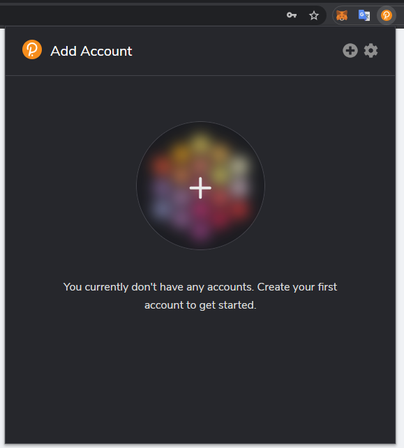
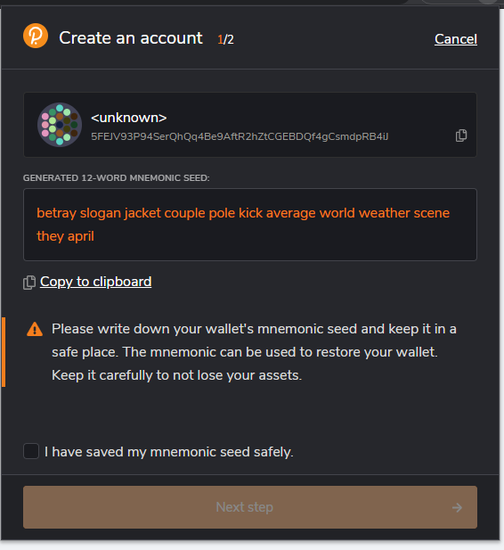
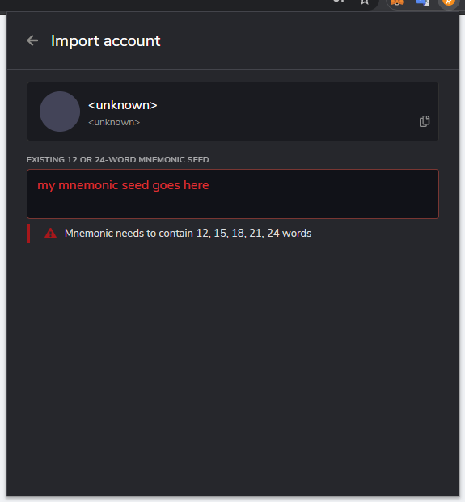

# Account Generation

### Glossary

* **Account** means a destination of funds, which can be credited or debited, and is under the control of a unique cryptographic keypair, where only the holder of the secret key can debit funds.
* **Account ID** means the public key of an Account compatible with substrate based chains. Equivalent to "**Public key (hex)**"
* **SS58 Address** means any valid SS58 encoding (Base58) of the Account ID. Equivalent to "Public key (SS58)". Note that unlike bitcoin, there is no one way hashing required to get the SS58 Address from the Account ID, so there is no information leaked by sharing the latter.
* **Joystream Network Address** means an SS58 Address encoded with the Joystream network prefix 126

## Introduction

This guide is primarily targeting current Stakeholders, meaning anyone with a claim on some allocation of Joystream mainnet tokens ($JOY) in the genesis block. The concepts of securely generating keys offline however will apply for others as well.

## Key Generation

Although there are other ways to generate keys we recommend `subkey`, a key generation and management utility developed and maintained by Parity Technologies. It's simple to use and allows keys to be generated offline. Both installation and usage is explained in the official [docs](https://docs.substrate.io/reference/command-line-tools/subkey/), that also contains plenty of examples. The downside of using the official release is that it doesn't support encoding the SS58 Address as Joystream Network Addresses out of the box.

Note that sharing your keys as Joystream Network Addresses is not required, as any Account ID and SS58 Address is sufficient. However, instructions for generating Joystream Network Addresses can be found [here](account-generation.md#joystream-network-address-generation).

A more user friendly alternative to the recommended key generation exists in the form of the [polkadot-js browser extension](https://polkadot.js.org/extension/). This is the default way of interacting with the Joystream chain, both for governance participants and content creators. Although there are some risks associated with generating keys in the browser generally, it may be a worthwhile tradeoff against the complexity of subkey, as a key generated here can be used without any further action.

Instructions for Account generation with polkadot-js can be found [here](account-generation.md#joystream-network-address-generation-1).

### Distribution

Stakeholders are free to distribute your allocation across as many Accounts as they wish. There are some pros and cons associated with any distribution, so we encourage Stakeholders, regardless of how actively they intend to participate on mainnet, to consider this when choosing the amount of Accounts, and the balance distribution.

Once a reasonable number of Accounts has been shared with us (at least half of the genesis tokens has been accounted for), we will create and maintain a table in the handbook allowing you to look up your Account(s) to confirm it's balance and vesting schedule.

### Deliverable

Please prepare a .csv file with the following information:

* Identifier (for reference only)
* Account ID
* Joystream Network Address (or any SS58 Address)
* Balance
  * Note that it may be beneficial

Example using the official subkey release, eg. generating keys as "generic" SS58 Addresses:

```
Identifier,Account ID,SS58 Address,Balance
0,0x82813aa36e07a42750852f6d47f8356577946f9bc0c617a1e543449ff80dbc4f,5F1pUHSPi46J3afWv3o4CPAu2wZtMX2r92XWW2MsSXefTTrB,5000
1,0xc8ce749ca7682a93459f8fe821b30027559d1329663c76e037160e60c32f347b,5GbzmH2Dc4uiA2jTA1RLJ1JdxQoTYecAX8QhKpmDjc5kg4Pr,2000
...
```

Same example, but with Joystream Network Addresses:

```
Identifier,Account ID,Joystream Network Address,Balance
0,0x82813aa36e07a42750852f6d47f8356577946f9bc0c617a1e543449ff80dbc4f,j4UGj3KgMambKtC7GC2Ek3XstZKeTrQc1ry9wsaQBsboJ6yh4,5000
1,0xc8ce749ca7682a93459f8fe821b30027559d1329663c76e037160e60c32f347b,j4VruLKGBUnQjzeBCRys29A1dUnt33YBLF538hNoYAgEPKejc,2000
...
```

How to transfer this information to the Jsgenesis team will be shared directly with the relevant Stakeholders.

### Testing

Before the mainnet launch, Jsgenesis will deploy a testing network, providing everyone an opportunity to test their keys.

## Joystream Network Address Generation

Although you may use download the temporary [binary](account-generation.md#binary) we have published, we recommend instead compiling your own version of `subkey` as outlined below.

### Fork and Compile Subkey

If you want to compile a version of `subkey` that supports Joystream Network Address, (fork and) clone the [substrate repo.](https://github.com/paritytech/substrate) Replace the default `ss58-registry` package in `primitives/core/Cargo.toml`: 

```
# From
ss58-registry = { version = "1.18.0", default-features = false }

# To
ss58-registry = { package = "ss58-registry", git = "https://github.com/Joystream/ss58-registry", branch = "joystream" }
```

Then follow the official [installation docs](https://docs.substrate.io/reference/command-line-tools/subkey/#installation).

You may now use the flag `-n joystream` to generate or inspect Joystream Network Addresses. Example:

```
$ ./subkey generate -n joystream

Secret phrase:       twice better blouse hire circle alpha mix outside climb employ slam bamboo
  Network ID:        joystream
  Secret seed:       0xe12f4b779e0944d85d6a5f47513df6a4088567df94181c74c50f5fc659592a62
  Public key (hex):  0xcc1ef0f6a5c0e2c82169656f0bd5b4b657cc7397bae107a148fda50279ba5b5c
  Account ID:        0xcc1ef0f6a5c0e2c82169656f0bd5b4b657cc7397bae107a148fda50279ba5b5c
  Public key (SS58): j4VwFPPGcpP77MuQbWdn7EbpBbjM4Siq5AGGuraF8ktr8vqjA
  SS58 Address:      j4VwFPPGcpP77MuQbWdn7EbpBbjM4Siq5AGGuraF8ktr8vqjA

$ ./subkey inspect -n joystream j4VwFPPGcpP77MuQbWdn7EbpBbjM4Siq5AGGuraF8ktr8vqjA

Public Key URI `j4VwFPPGcpP77MuQbWdn7EbpBbjM4Siq5AGGuraF8ktr8vqjA` is account:
  Network ID/Version: joystream
  Public key (hex):   0xcc1ef0f6a5c0e2c82169656f0bd5b4b657cc7397bae107a148fda50279ba5b5c
  Account ID:         0xcc1ef0f6a5c0e2c82169656f0bd5b4b657cc7397bae107a148fda50279ba5b5c
  Public key (SS58):  j4VwFPPGcpP77MuQbWdn7EbpBbjM4Siq5AGGuraF8ktr8vqjA
  SS58 Address:       j4VwFPPGcpP77MuQbWdn7EbpBbjM4Siq5AGGuraF8ktr8vqjA
```

### Binary

We have published a binary of a node that supports Joystream Network Address that can be downloaded [here](https://github.com/Joystream/joystream/releases). Note that the node is built for this purpose alone, and should (may) not be used to connect with any current (testnet) or future mainnet.

This will allow you to:

* generate a Joystream Network Address with the command `./joystream-node key generate`
* inspect a private key with the command `./joystream-node key inspect SECRET SEED`
* inspect a public key with the command `./joystream-node key inspect --public SECRET SEED`
* inspect a Joystream Network Address with the command `./joystream-node key inspect`

A keypair generated with this version can be inspected with the official subkey, and will then confirm the Network ID to be 126.

Example:

```
# With joystream-node:
$ ./joystream-node key generate

Secret phrase:       twice better blouse hire circle alpha mix outside climb employ slam bamboo
  Network ID:        joystream
  Secret seed:       0xe12f4b779e0944d85d6a5f47513df6a4088567df94181c74c50f5fc659592a62
  Public key (hex):  0xcc1ef0f6a5c0e2c82169656f0bd5b4b657cc7397bae107a148fda50279ba5b5c
  Account ID:        0xcc1ef0f6a5c0e2c82169656f0bd5b4b657cc7397bae107a148fda50279ba5b5c
  Public key (SS58): j4VwFPPGcpP77MuQbWdn7EbpBbjM4Siq5AGGuraF8ktr8vqjA
  SS58 Address:      j4VwFPPGcpP77MuQbWdn7EbpBbjM4Siq5AGGuraF8ktr8vqjA

$ ./joystream-node key inspect j4VwFPPGcpP77MuQbWdn7EbpBbjM4Siq5AGGuraF8ktr8vqjA

Public Key URI `j4VwFPPGcpP77MuQbWdn7EbpBbjM4Siq5AGGuraF8ktr8vqjA` is account:
  Network ID/Version: joystream
  Public key (hex):   0xcc1ef0f6a5c0e2c82169656f0bd5b4b657cc7397bae107a148fda50279ba5b5c
  Account ID:         0xcc1ef0f6a5c0e2c82169656f0bd5b4b657cc7397bae107a148fda50279ba5b5c
  Public key (SS58):  j4VwFPPGcpP77MuQbWdn7EbpBbjM4Siq5AGGuraF8ktr8vqjA
  SS58 Address:       j4VwFPPGcpP77MuQbWdn7EbpBbjM4Siq5AGGuraF8ktr8vqjA

# With official subkey

$ subkey inspect j4VwFPPGcpP77MuQbWdn7EbpBbjM4Siq5AGGuraF8ktr8vqjA

Public Key URI `j4VwFPPGcpP77MuQbWdn7EbpBbjM4Siq5AGGuraF8ktr8vqjA` is account:
  Network ID/Version: 126
  Public key (hex):   0xcc1ef0f6a5c0e2c82169656f0bd5b4b657cc7397bae107a148fda50279ba5b5c
  Account ID:         0xcc1ef0f6a5c0e2c82169656f0bd5b4b657cc7397bae107a148fda50279ba5b5c
  Public key (SS58):  j4VwFPPGcpP77MuQbWdn7EbpBbjM4Siq5AGGuraF8ktr8vqjA
  SS58 Address:       j4VwFPPGcpP77MuQbWdn7EbpBbjM4Siq5AGGuraF8ktr8vqjA
```

This means regardless if you choose to generate your keypairs with the official `subkey` or `joystream-node key`, you can verify the results using the other in an online setting without exposing your private keys on an online computer.


## Polkadot{.js} Account Generation

The Polkadot wiki have created their own guide, which can be found [here](https://wiki.polkadot.network/docs/learn-account-generation#polkadotjs-browser-extension). However, as with subkey, displaying the Joystream Network Address format as default is not possible without some extra steps.

Below, you will find a slightly modified version of the same guide, with references to the polkadot network are removed and some joystream specific information is added.

### Polkadot{.js} Browser Extension

The [Polkadot{.js} Extension](https://polkadot.js.org/extension/) provides a reasonable balance of security and usability. It provides a separate local mechanism to generate your address and interact with Polkadot.

This method involves installing the Polkadot{.js} plugin and using it as a “virtual vault," separate from your browser, to store your private keys. It also allows the signing of transactions and similar functionality.

#### Create Account

Open the Polkadot{.js} browser extension by clicking the logo on the top bar of your browser. You will see a browser popup, not unlike the one below.



Click the big plus button or select "Create new account" from the small plus icon in the top right. The Polkadot{.js} plugin will then use system randomness to make a new seed for you and display it to you in the form of twelve words.



Back up these words, as it's the only way to recover your Account if your computer is lost or wiped. It is imperative to store the seed somewhere safe, secret, and secure. If you cannot access your account via Polkadot{.js} for some reason, you can re-enter your seed through the "Add account menu" by selecting "Import account from pre-existing seed".



#### Name Account

The account name is arbitrary and for your use only. It is not stored on the blockchain and will not be visible to other users who look at your address via a block explorer. If you're juggling multiple accounts, it helps to make this as descriptive and detailed as needed.

#### Enter Password

The password will be used to encrypt this account's information. You will need to re-enter it when using the account for any kind of outgoing transaction or when using it to cryptographically sign a message.

Note that this password does NOT protect your seed phrase. If someone knows the twelve words in your mnemonic seed, they still have control over your account even if they do not know the password.

### Address Format

Your address' format is only visual - the data used to derive this representation of your address are the same, so you can use the same address on multiple chains. However, for privacy reasons, we recommend creating a new address for each chain you're using.

You can copy your address by clicking on the account's icon while the desired chain format is active. E.g. selecting "Substrate" as the format will change your address to start with the number 5, and clicking the colorful icon of your account will copy it in that format. While in Polkadot mode (starts with 1), that format will be copied, and so on.

#### Verify Joystream Address Format

You can display your new Account in the Joystream Network Address format, and even make test transaction on a staging network, without installing any additional software.

Suppose I create an Account and name it "test" using the extension. This will display the address in the default SS58 Address format.


Open the [polkadot{.js} app,](https://polkadot.js.org/apps) with [this link](https://polkadot.js.org/apps/?rpc=wss://172.104.229.249.nip.io/ws-rpc#/accounts), as it also configures your endpoint to `wss://172.104.229.249.nip.io/`, a development network we have deployed for this purpose.

Allow your extension to connect to the website, and make sure any Accounts you want to use for the Joystream network is configured to "Allow use on any chain". The `accounts` tab of the app should now display your own Account(s), together with the default development chain Accounts (which you should not use to receive any JOY with).


Click on the Account of "interest", and you will be shown the full Joystream Network Address.


Feel free to send a test transaction to your Account and back.
