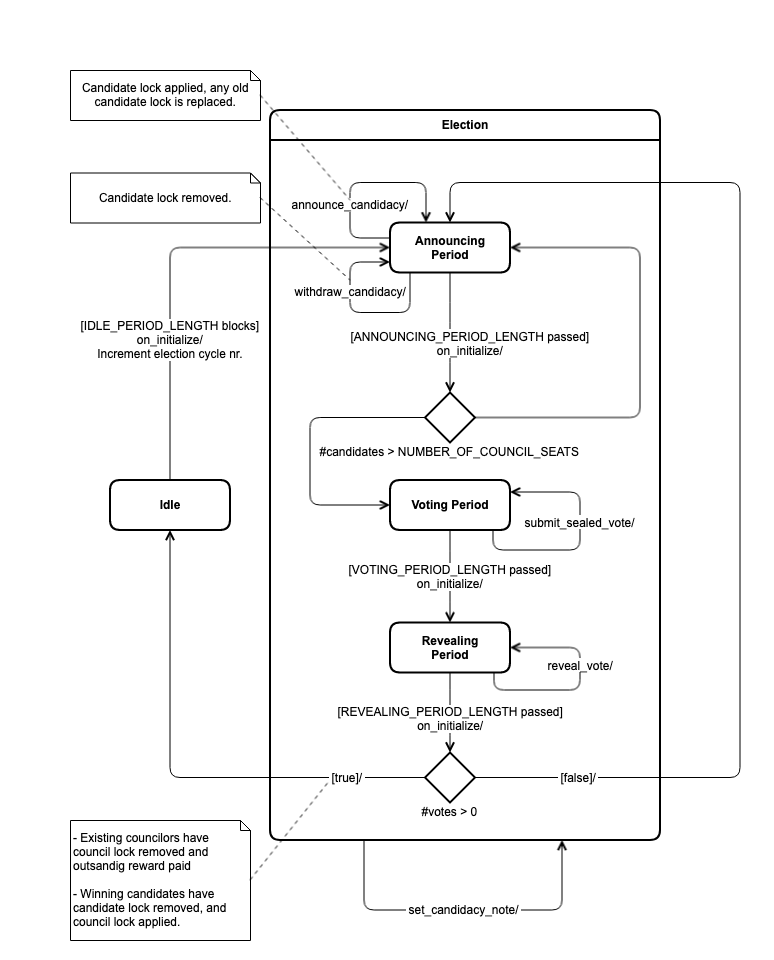

# 🏛 Council

## Introduction

The council is a fixed size committee, up for election at regular intervals by token holders, tasked with the role of voting on proposals in the proposal system. At the heart of the governance process on the platform is the proposal system, which allows anyone to submit some suggestion for changing the state or policy of the platform in some way. These proposals are processed and voted on by a council, where the participants are referred to as council members. A seat on the council is won through an election process, and lasts for some period of time until a new election.

## Notion Space

The community maintains a distinct Notion space which holds more dynamic information on the activities of the council.



## Council Member

### Responsibilities

* Discuss the meaning and merits of incoming proposals, covering a broad range of topics
* Vote on proposals
* Represent the community members and your constituency to make day-to-day operations decisions

### Requirements

* Proficiency with basic data analysis and sufficient reputation and standing within the community to earn supporting votes in elections from other platform members
* A deep understanding of the Joystream platform structure, function and resource allocation
* Hold sufficient amount of the native platform token to put at stake

## Roles

The relevant roles in the council system are

* **Voters:** Anyone who stakes for the purposes of influencing the outcome of an election. Is not tied to membership, so a member can vote multiple times for different candidates from different accounts.
* **Candidate:** A member who has staked and stands as an alternative for councilorship in an ongoing election cycle.
* **Councilor:** A member who has stood as a candidate in an election and won a place in a council. Has the primary responsibility to participate in voting on and deliberating around proposals in the proposal system.

## Concepts

### Staking

The main idea behind how stake is managed is that we want to allow reuse of stake in ways that encourage participation, so specifically

1. any stake that has been deployed for voting, should be reusable for any other purpose, and vice versa.
2. stake used to sit on the council should be reusable for being a candidate in the next.

One easy way to manage reuse across purposes, where the new use may require more or less stake than the existing use, is to take advantage of the non-stacking property of locks. For this reason, there are three kinds of locks associated with the council, as described below.

#### Voting

When voting, one votes simply with an account, and it does not matter what other locks exist, except for voting, on that account, whatever amount you lock fully counts towards the election outcome. A single member can of course vote multiple times with different accounts on different candidates.

If someone voted for a candidate in an election, they will and can free their stake at a later time. Importantly, a vote which was devoted to a losing candidate can be freed the moment the election cycle is over, while a vote which was devoted to a winner can only be freed after the announcing period of the next election begins. The idea behind this asymmetry is to more closely expose the winners to the consequences of their decision.

#### Candidacy

When announcing candidacy, one does so as a member. One has to stake with an account bound to the membership, and, this account can only be simultaneously locked for voting in some past election, using lock id `VOTING_LOCK_ID`. If someone announced their candidacy in an election, but did not end up winning, then they can at any time after the conclusion of that election cycle free their stake.

#### Council

When winning an election, your candidacy lock will be automatically removed, and a council specific lock will be applied, with the same amount locked. When that council is replaced, this lock is removed, if you did not get re-elected.

### Budget

The budget of the council is the root resource pool for all token minting on the platform, _with the exception of validator rewards_. The lifetime of the budget is divided into periods, called _budget periods_, which occurs every `BUDGET_PERIOD_LENGTH` blocks. The number of tokens added to the budget at the end of each such period is held in a mutable parameter denoted as `budget_increment` .

Whenever one of the following actions occur, the budget is impacted as described.

| Event                                     | Budget Impact       |
| ----------------------------------------- | ------------------- |
| Working group budget increased by `X > 0` | `-X`                |
| Working group budget decreased by `X > 0` | `+X`                |
| Spending proposal with amount `X > 0`     | `-X`                |
| Council reward payout `X > 0`             | `-X`                |
| Budget period ends                        | `+budget_increment` |

Events that negatively impact the budget balance can only occur if the impact does not occur if they exceed the balance of the budget.

_Notice that working group spending, such as lead spending, or subsystem specific spending, such as minting initial credit for invited new members, does not directly count against the council budget, but against the relevant working group budget._

### **Council**

The council has a fixed number of seats `NUMBER_OF_COUNCIL_SEATS` occupied by members, called _councilors_. The seats are always occupied, allowing the platform to dispose of all proposals they may come in at any time. The council body has two high level states described as follows.

* **Normal:** During this stage the council operates normally. After `NORMAL_PERIOD_LENGTH` blocks have passed since this period started, a transition is made to the election stage.
* **Election:** During this stage, not only does the council operate, but there is an election ongoing. Read more about elections the [Council](council/broken-reference/) section below.

#### Rewards

Every `REWARD_PERIOD_LENGTH` blocks all councilors are paid out the same flat reward rate and any possibly outstanding owed reward. This rate is held in a mutable parameter, called the _councilor reward_, denoted as `councilor_reward` . During this payout, where councilors are processed in some consistent order, the crediting only occurs while the budget constraint is respected. For each payout, the constraint is tightened. If a councilors cannot be paid out in full, then the difference is added to their owed reward. When a council period ends, any owed reward and outstanding reward from the last payout, are attempted paid out, however if the budget does not allow it, then the councilor suffers the loss.

### Candidacy

A candidacy is defined by the following information

* **Member:** The member behind the candidacy.
* **Program:** A human readable description of the candidacy. Some socially enforced schema for the encoding of the program.
* **Cycle Id:** The election cycle to which this candidacy corresponds.
* **Staking account:** The account holding the stake for the candidate. After announcing the staking account will have locked up `REQUIRED_CANDIDACY_STAKE` under the relevant council lock. If the candidacy fails - either because the election cycle fails or the candidate receives too few votes, then this lock can be removed by the candidate, otherwise it remains on into the councilorship. Be aware that this stake contributed towards the candidacy does _not_ contribute towards the final election outcome, hence exceeding the minimum bound would only be done for signaling or other social purposes.
* **Votes Received:** The total amount token votes received by this candidate in revealing period ofthe election, is zero before that time.

Note that, while there is no explicit identifier, a candidacy can be implicitly identified by a combination of the member, the order of this announcement for this member - as one could in principle announce and withdraw multiple times, and finally the election cycle number.

### Councilor

A councilor is defined by the following information

* **Member:** The membership to which this role corresponds.
* **Role account**: The account currently used to authenticate as this role.
* **Reward account**: The destination account to which periodic rewards are paid out.
* **Staking account:** Holds the stake currently associated with the role. Locks`REQUIRED_CANDIDACY_STAKE` under the relevant council lock which is recoverable when councilorship ends.
* **Owed reward:** The total reward this councilor was not paid over a number of payout periods where there was not sufficient funds in the council budget.

Notice that, while there is no explicit identifier, a councilorship can be implicitly identified by a combination of the member and the election cycle number.

### Vote

A vote is a defined by the following

* **Staking account:** Holds the stake associated with the vote. A given account can only be involved in a single vote for a given election cycle (see [Council](council/broken-reference/)).
* **Staking balance:** The amount of funds in the staking account encumbered for this vote, will be no less than `MINIUMUM_VOTING_STAKE`.
* **Cycle Id:** The election cycle in which the vote was cast.
* **Stage:** The vote has two stages, being _sealed_ and _unsealed, each having the following associated information_
  * **Sealed:** This is the initial stage when a vote is submitted during a the voting period of an election. The only information available is called a voting commitment, which is a **opaque hash digest**.
  * **Unsealed:** This is the stage which occurs if the voter chooses to reveal the their sealed vote during the revealing stage. This has stage has information about a **valid candidate**, and a **nonce**, which when concatenated together are the pre-image of the initial hash digest.

Notice that, while there is no explicit identifier, a vote can be implicitly identified by a combination of the staking account and the election cycle number.

Unlocking the voting lock on the staking account requires an active recovery action on the voter, and it follows the following rules

* If the vote is for an ongoing election, then it is not recoverable.
* If the vote is for the last concluded election and one is still in the immediately following idle period, then it is recoverable only if it was unsealed in favor of a losing candidate, otherwise it is not.
* If the vote is for any election before the last concluded, the it is always recoverable.

### Election

An election is the periodic process by which a new council is selected by voters among candidates running for a seat on the next council. Elections occur periodically, and each one has a sequence of stages referred to as the election cycle. Each cycle is identified with an id, called the _election cycle id,_ which is just the cycle number. An election will begin while the current council is active, and the sitting council is only relieved once a new one has been successfully elected. As will become clear, this process can go on for a unknown amount of time. The election cycle has the following stages

* **Announcing Period:** This is the first stage in the election cycle. During this time members can announce that they will stand as candidates for the next council. Such an announcement can later be withdrawn within this same period, without consequences. The same member can only have a single candidacy active at any given time, but can in principle announce and withdraw an unlimited number of times. Importantly, if less than the minimum number of candidates have announced by the end of this period, a new election cycle starts. All candidates can recover their stake from such a failed cycle instantly, but it requires action, and anyone wanting to stand for the next election will need to announce again.
* **Voting Period:** This is the stage where voters can submit votes in favor of candidates. The votes are sealed, meaning that it is only known that some account voted for an unknown, possibly invalid candidate, with a known amount of tokens.
* **Revealing Period:** During this stage, voters can reveal their sealed votes. Any valid vote which is unsealed is counter, and in the end a winning set of candidates is selected. Importantly, even if there is an insufficient number of valid votes revealed to render a set of winners with non-zero backing stake, the runtime will just pick a winning set deterministically. Importantly, if less than `NUMBER_OF_COUNCIL_SEATS` candidates receive at least one vote by the end of this period, a new election cycle starts. All candidates can recover their stake from such a failed cycle instantly, but it requires action, and anyone wanting to stand for the next election will need to announce again. Lastly, any outstanding owed reward is not carried over between different council.

The stages and transitions, are summarized in the figure below.

## Constants

The following constants are hard coded into the system, they can only be updated with a runtime upgrade.

| Name                       | Description                                                                              | Value               |
| -------------------------- | ---------------------------------------------------------------------------------------- | ------------------- |
| `NUMBER_OF_COUNCIL_SEATS`  | The number of council seats.                                                             |                  3  |
| `IDLE_PERIOD_LENGTH`       | The number of blocks in the normal period.                                               |            201 600  |
| `ANNOUNCING_PERIOD_LENGTH` | The number of blocks in the announcing period                                            |             86 400  |
| `VOTING_PERIOD_LENGTH`     | The number of blocks in the voting period.                                               |             57 600  |
| `REVEALING_PERIOD_LENGTH`  | The number of blocks in the revealing period.                                            |             57 600  |
| `REWARD_PERIOD_LENGTH`     | 
The number or blocks between each reward payout to councilors.
                 |             14 400  |
| `BUDGET_PERIOD_LENGTH`     | 
The number of blocks between each time the the

council budget is topped up.
 |             14 400  |
| `REQUIRED_CANDIDACY_STAKE` | The required amount of stake for a candidate.                                            |     166 666.67 JOY  |
| `MINIMUM_VOTING_STAKE`     | The minimum allowable stake in a vote.                                                   |         166.67 JOY  |
| `MAX_SALT_LENGTH`          | The maximum length of salt is used to calculate a vote's sealed commitment.              |                 32  |
| `MINIMUM_CANDIDATES_COUNT` | The minimum number of candidates needed for the election to become legitimate.           |                  1  |
| `VOTING_LOCK_ID`           | The Id for the lock used to vote.                                                        | 0x766f74696e672020  |
| `CANDIDACY_LOCK_ID`        | The Id for the lock used for candidacy.                                                  | 0x63616e6469646163  |
| `COUNCILOR_LOCK_ID`        | The Id for the lock used for councilorship.                                              | 0x636f756e63696c6f  |
Last Update Date: 2024-03-13

## Extrinsics

### Announce Candidacy

#### Parameters

| Name                 | Description                                                              |
| -------------------- | ------------------------------------------------------------------------ |
| `membership_id`      | Membership id uniquely identifying the user.                             |
| `staking_account_id` | Staking account.                                                         |
| `reward_account_id`  | Account receiving councilors rewards in the case candidate gets elected. |
| `stake`              | Amount of currency user wants to stake for the candidacy.                |

#### Conditions

* Signer is controller account of member with identifier `membership_id`.
* There is an active election in the **Announcement Period**.
* There is no prior candidacy in this election for `membership_id`.
* `staking_account_id` has no conflicting locks (see [Staking](council/broken-reference/)).
* `staking_account_id` has enough balance to be locked as candidacy stake.
* `staking_account_id` is associated with the member.
* The `stake` must be at least `REQUIRED_CANDIDACY_STAKE`.

#### Effect

Any past candidacy and lock is removed, and a new candidacy is created for the given election cycle, and a candidacy lock is applied with the amount `stake`.

### Withdraw Candidacy

#### Parameters

| Name            | Description                                  |
| --------------- | -------------------------------------------- |
| `membership_id` | Membership id uniquely identifying the user. |

#### Conditions

* Signer is controller account of member with identifier `membership_id`.
* There is an active election in the **Announcement Period**.
* The member has announced candidacy for this election cycle.

#### Effect

The candidacy and candidacy lock is removed.

### Submit Sealed Vote

#### Parameters

| Name         | Description                                          |
| ------------ | ---------------------------------------------------- |
| `commitment` | The sealed vote representation.                      |
| `stake`      | Amount of currency user wants to stake for the vote. |

#### Conditions

* Is signed with some account `staking_account_id`.
* There is an active election in **Voting Period**.
* The `staking_account_id` account has no associated vote for the current election cycle.
* The `staking_account_id` total balance no less than `stake`.
* The `stake` must be at least `MINIUMUM_VOTING_STAKE`.

#### Effect

Any possible vote and corresponding voting lock from a prior election is removed. A sealed vote for the current cycle is created, including `commitment`.

### Reveal Vote

#### Parameters

| Name           | Description                                    |
| -------------- | ---------------------------------------------- |
| `salt`         | The salt used to verify the sealed commitment. |
| `candidate_id` | Member identifier for candidate.               |

#### Conditions

* There is an active election in the **Revealing Period**.
* Is signed with some account `staking_account_id` which has vote in the current election cycle.
* Vote is in **Sealed** stage.
* `salt`length is not higher than `MAX_SALT_LENGTH`.
* `candidate_id` \_\_identifies a candidate in the current election.
* The commitment in the vote is verified to correspond to the provided `salt` and `candidate_id`.

#### Effect

The amount of the voting lock is added to votes received of the candidate, and the vote has stage updated to **Unsealed**.

### Recover Voting Stake

#### Parameters

None.

#### Conditions

* Is signed with some account `staking_account_id` which has vote.
* Vote is either for
  * a prior election cycle
  * the current election cycle, and is **Unsealed** for a candidate which did not make it into the council

#### Effect

Voting lock is removed from account and vote is removed.

### Recover Failed Candidacy Stake

#### Parameters

| Name           | Description                      |
| -------------- | -------------------------------- |
| `candidate_id` | Member identifier for candidate. |

#### Conditions

* Signer matches controller account of member identified with `candidate_id`.
* Member has existing candidacy.
* If candidacy is for the current election cycle, the there election must be in the idle phase.

#### Effect

Candidate lock is removed from staking account of candidate, and candidate is removed.

### Submit Candidacy Note

#### Parameters

| Name            | Description                                                                                                                          |
| --------------- | ------------------------------------------------------------------------------------------------------------------------------------ |
| `membership_id` | Membership identifier.                                                                                                               |
| `note`          | Encoded [candidacy note](council/broken-reference/) metadata (subsequent calls will only affect explicitly provided metadata fields) |

#### Conditions

* Signer is controller account of member corresponding to `membership_id`.
* Member has existing candidacy.
* The candidacy is for the current election cycle, and the election phase is not idle.

#### Effect

The note is associated with a candidate.
