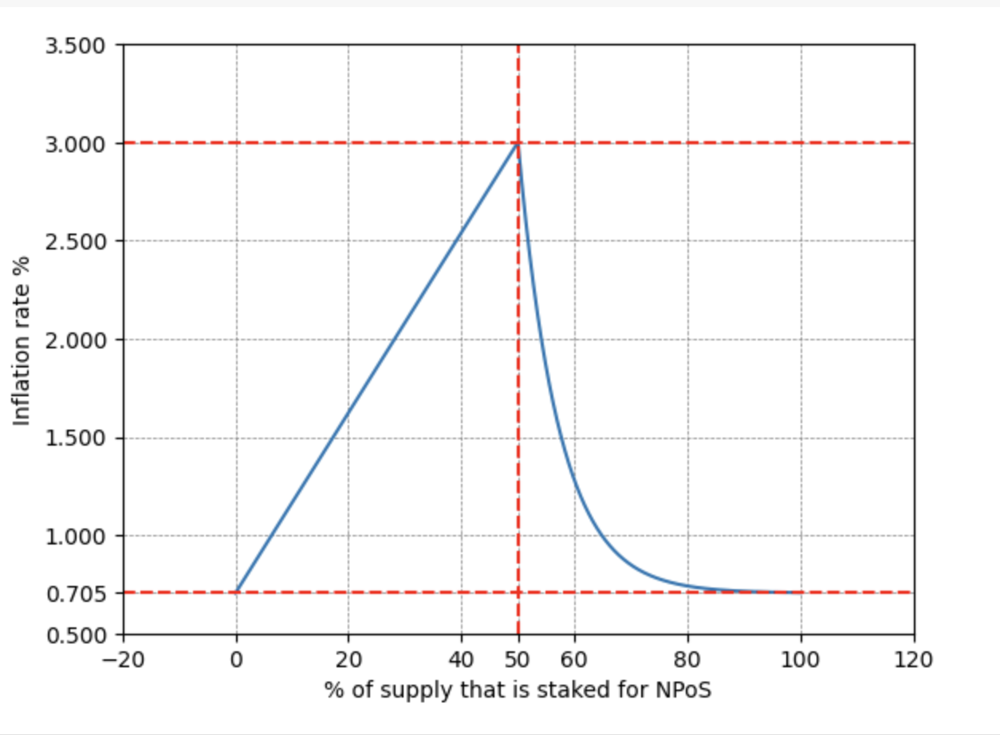
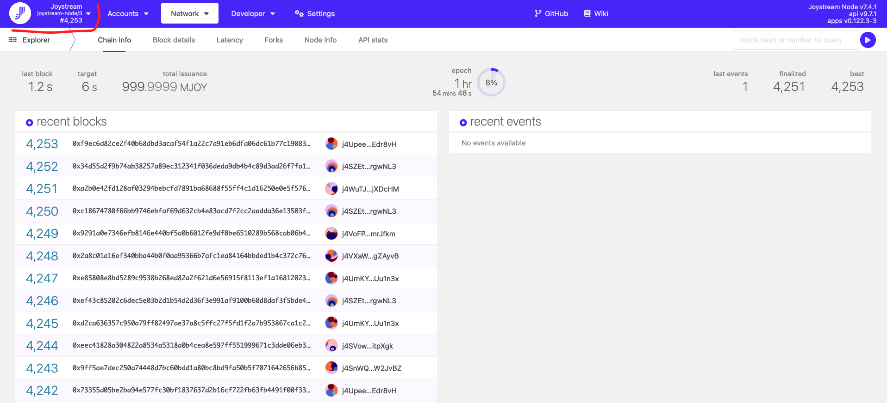

# 🏭 Validation

## Intro

The Nominated Proof of Stake (NPoS) employed in the Joystream ecosystem is an advanced consensus mechanism that relies on the collaborative efforts of validators and nominators to ensure network security. Validators, pivotal in this framework, are tasked with block production and transaction validation. To qualify as validators, participants must _bond_ a specified quantity of tokens, a process which symbolizes their commitment and aligns their interests with the network's stability. Once tokens are bonded, they can then be _staked_ for engaging in block validation and acquiring rewards. Meanwhile, nominators, after initially bonding their tokens, play a crucial role by selecting reliable validators and allocating their bonded tokens to them, thus bolstering the network's overall security and efficiency. In Joystream, an 'era' denotes a set period during which staking rewards are determined and allocated in accordance with the contributions of validators and nominators. These rewards serve dual purposes: they incentivize participation and offset the inflationary impact of new token generation. To safeguard network integrity, Joystream incorporates a 'slashing' mechanism. This punitive measure targets validators engaging in harmful activities or exhibiting incompetence, penalizing them by destroying a portion of their staked tokens.

## Reward and Inflation

Tokens are minted as part of the inflationary mechanism to compensate validators and nominators for their participation and contribution to network security. This minting process is automated and governed by the network's consensus rules. The newly minted tokens are distributed as rewards at the end of each era.
The mathematical expression used in reward computation is referred as _reward curve_ and it's graph is as follows



The minimum and maximum inflation for stakers reward values of `0.705%` and `3%` are highlighted in the y axis and the ideal staking percentage of `50%` is highlighted in the x axis. The reward curve is such that stakers are incentivised if the the current staking percentage is below the ideal rate and disincentivized if it's above the ideal rate.

The current percentage of supply staked can be inspected in Joystream the [subscan dashboard](https://joystream.subscan.io/)

## Staking reward computation

Below is an illustrative example on how validator can determined their profit margin given their initial operational cost of setting up a server.
Let's start with the following assumptions:

### Network Parameters:

1. **Total Supply of Tokens:** 1,000,000,000 tokens.
2. **Annual Inflation Rate for NPoS Rewards:** 1.3%.
3. **Percentage of Tokens Staked:** 12%.
4. **Era Length:** 6 hours.

### Validators and Nominators Configuration:

1. Validator 1 (v1): 40,000,000 JOY, 20% commission (9 validators, 9 nominators).
2. Validator 2 (v2): 40,000,000 JOY, 40% commission (3 validators, 6 nominators).
3. Validator 3 (v3): 30,000,000 JOY, 10% commission (4 validators, 4 nominators).
4. Validator 4 (v4): 10,000,000 JOY, 0% commission (1 validator, 5 nominators).

### Total Staked and Era Reward Pool:

1. **Total Staked Tokens:** 12% of 1,000,000,000 = 120,000,000 JOY.
2. **Annual Reward Pool:** 1,000,000,000 \* 1.3% = 13,000,000 JOY.
3. **Reward Pool per Era:** 13,000,000 JOY / (24 \* 365 / 6) = 8910.96 JOY (approx).

### Era Points and Reward Distribution:

Era points are a measure of a validator's contribution to the network during an era. These points are awarded for various actions like validating blocks, producing blocks, and other network-supportive actions. The specific allocation of era points can vary based on the network's rules and validators' performance.

Validator era point are used to computed the share of each validator for the total reward pool, using the formula `validatorPoints / totalPoints`: where `totalPoints` is the total number of points earned by all validators in the era, and `validatorPoints` is the number of points awarded to each unique
validator during the same era. Suppose for simplicity that the share is proportional to the validator stake percentage over the total staked amount in the network:

1. Validator 1's share `v1s`: 40,000,000 / 120,000,000.
2. Validator 2's share `v2s`: 40,000,000 / 120,000,000.
3. Validator 3's share `v3s`: 30,000,000 / 120,000,000.
4. Validator 4's share `v4s`: 10,000,000 / 120,000,000.

However, in practice, era points are not strictly proportional to stake but depend on actual performance and contributions, which can vary.

### Calculating Rewards:

1. **Validator 1's Total Reward:**

   - Era Points Share: `v1s` \* 8910.96 JOY = 2970.32 JOY.
   - Commission: 20% of 2970.32 JOY = 594.06 JOY.
   - Nominators' Share: 2970.32 JOY - 594.06 JOY = 2376.26 JOY.

2. **Validator 2's Total Reward:**

   - Era Points Share: `v2s` \* 8910.96 JOY = 2970.32 JOY.
   - Commission: 40% of 2970.32 JOY = 1188.13 JOY.
   - Nominators' Share: 2970.32 JOY - 1188.13 JOY = 1782.19 JOY.

3. **Validator 3's Total Reward:**

   - Era Points Share: `v3s` \* 8910.96 JOY = 2227.74 JOY.
   - Commission: 10% of 2227.74 JOY = 222.77 JOY.
   - Nominators' Share: 2227.74 JOY - 222.77 JOY = 2004.97 JOY.

4. **Validator 4's Total Reward:**
   - Era Points Share: `v4s` \* 8910.96 JOY = 742.58 JOY.
   - Commission: 0% of 742.58 JOY = 0 JOY.
   - Nominators' Share: 742.58 JOY.

### Nominator Rewards:

Each nominator's reward depends on their stake with a specific validator. For instance, a nominator who staked 10% of the total stake with Validator 1 would receive 10% of 2376.26 JOY = 237.63 JOY, and so on for other validators and nominators.

### Conclusion

From the numbers above validators can compute the respective USD revenue per era, which can then be used for budgeting

## Glossary

**`bonding duration`**

The amount of `eras` before a `bonded` account that unbonds has to wait until their tokens **can** be unlocked by the `staking` lock.

This will allow the tokens to be staked for "rivalrous" purposes, and, if no other locks are applied, be spent freely.

Set to 112 `eras`, eg \~403200 blocks, or 28 days.

**`commission`**

**`candidates`**

Validators and nominators get paid from block production on the network, where validators can set a variable commission rate, which is initially subtracted from the total rewards that validator is entitled to (for that period), where the commission determines the rate of distribution for the remaining rewards set out for the nominators that are backing that validator.

Set by the validator as a percentage of the reward for each `era`.

**`election`**

An operation performed automatically on-chain, by the runtime, to elect a new set of validators for the upcoming `era`. Who gets elected depends on a variety of factors, such as the amount of `candidates`, the number of `slots` and the `total active stake` for each validator.

**`era`**

A (whole) number of `sessions`, which is the period that the validator set (and each validator's active nominator set) is recalculated and where rewards are paid out.

Target is 6 `sessions`, eg \~3600 blocks, or 6h.

**`era points`**

Every time a specific validator produces a block, they earn points. The rewards for the individual validator for that `era` are proportional to their era points, which are reset when a new `era` begins.

**`nominator`**

Accounts that select a set of validators to nominate by bonding their tokens. Nominators receive some of the validators' rewards, but are also liable for slashing if their nominated validators misbehave.

**`rewards`**

The shared rewards earned by the entire validator set for each `era`. For the individual `validator`, they are proportional to the `era points` earned.

Note that the `total active stake` does not impact the `era points` or rewards directly, but of course, unless the validator gets a slot, they will not earn any rewards.

**`session`**

A session is a Joystream implementation term for a period that has a constant set of validators. Validators can only join or exit the validator set at a session change.

Target is \~600 blocks, or 1h.

**`session keys`**

Hot (must be online) keys that are used for performing network operations by validators, for example, signing GRANDPA commit messages.

**`slashing`**

The removal of a percentage of an account's JOY as a punishment for a validator acting maliciously or incompetently (e.g., equivocating or remaining offline for an extended period).

Will apply equally to nominators of a validator that gets slashed.

**`slots`**

Total amount of spots in the validator set at any given time. Can be adjusted up or down through a proposal.

**`staking`**

The act of bonding JOY tokens by putting them up as "collateral" for a chance to produce a valid block (and thus obtain a block reward). Validators and nominators stake their JOY in order to secure the network.

**`total active stake`**

The sum of stake put up by the validator itself, plus the amount each of the (potential) `nominators` backs the validator with. Used to the determine whether the validator gets a `slot` in the validator set or not in the `election` for the upcoming era.

## Introduction

The Joystream platform state lives on a blockchain consensus system. This consensus system is a variant of classical BFT consensus combined with Proof-of-Stake to determine who gets to be a consensus participant, i.e. validator. A validator is an actor which checks the validity of newly constructed blocks, proposes new blocks and participates in the consensus process for committing new blocks to the chain. This role has a purpose very similar to the miners in the Bitcoin blockchain. Importantly, anyone can fully check the validity of the blockchain, not just validators, and this is called validation.

## Validator

### Responsibilities

- Run and maintain screening nodes that are always available and performant
- Help enforce the consensus rules of the network

### Requirements

- Experienced with how to setup and maintain high performance IT infrastructure
- Access to highly performant and reliable IT infrastructure, with high storage, (up & down) bandwidth and processing capacity
- Able to securely store keys
- Hold sufficient amount of the native platform token to put at stake
  - currently **at least** JOY 41.667k in a single account, which is the minimum to sign up – actually getting a validator slot likely requires more

#### Hardware Requirements

The Joystream blockchain, and therefore the `joystream-node` is built on the [substrate](https://substrate.io/) framework, developed for the [Polkadot](https://polkadot.network/) ecosystem. As Joystream is still in infancy on mainnet, we refer to the their expertise for the technical specification and [recommendations](https://wiki.polkadot.network/docs/maintain-guides-how-to-validate-polkadot#reference-hardware):

- **CPU**
  - x86-64 compatible;
  - Intel Ice Lake, or newer (Xeon or Core series); AMD Zen3, or newer (EPYC or Ryzen);
  - 4 physical cores @ 3.4GHz;
  - Simultaneous multithreading disabled (Hyper-Threading on Intel, SMT on AMD);
  - Prefer single-threaded performance over higher cores count. A comparison of single-threaded performance can be found [here](https://www.cpubenchmark.net/singleThread.html).
- **Storage**
  - An NVMe SSD of 1 TB (As it should be reasonably sized to deal with blockchain growth). An estimation of current chain snapshot sizes can be found [here](https://paranodes.io/DBSize). In general, the latency is more important than the throughput.
- **Memory**
  - 16GB DDR4 ECC.
- **System**
  - Linux Kernel 5.16 or newer.
- **Network**
  - The minimum symmetric networking speed is set to 500 Mbit/s (= 62.5 MB/s). This is required to support a large number of parachains and allow for proper congestion control in busy network situations.

It should be obvious that given the life span and size – thus state and transaction activity – of Polkadot relative to Joystream at this stage, it is certainly fine to scale down on things like storage...

## Guides

The instructions below cover Linux binaries only. If you want to build from source, clone the [repo](https://github.com/Joystream/joystream) and follow the build steps there.

### Install and Deploy

- Every time something is written in `<brackets>`, this means you have to replace this with your input, without the `<>`.
- When something is written in `"double_quotes"`, it means the number/data will vary depending on your node or the current state of the blockchain.
- For terminal commands:
  - `$` means you must type what comes afterwards
  - `#` means it's just a comment/explanation for the readers convenience

```

# This is just a comment, don't type or paste it in your terminal!

$ cd ~/

# Only type/paste the "cd ~/, not the preceding $ !

```

For the purposes of simplicity, we will assume:

1. You are user `joystream`, with sudo priveliges.
2. You want to save everything in `/home/joystream/bin/`

#### Download Node Binary

Find the latest release [here](https://github.com/Joystream/joystream/releases/latest) or get the tag from the command line with:

```

$ curl -sL https://api.github.com/repos/Joystream/joystream/releases/latest | jq -r ".tag_name"

```

At the time of writing, the latest release is `v12.1001.0`, whereas the last node binary is from version `v12.1000.0` (mainnet)

```

# Create the directory, and go there

$ mkdir ~/bin && cd ~/bin

# Assuming the latest version is still v12.1000.0

# Download the binary:

$ wget https://github.com/Joystream/joystream/releases/download/v12.1000.0/joystream-node-8.0.0-1a0d1f677df-x86_64-linux-gnu.tar.gz

# unzip it:

$ tar -vxf joystream-node-8.0.0-1a0d1f677df-x86_64-linux-gnu.tar.gz

# Download the chain spec:

$ wget https://github.com/Joystream/joystream/releases/download/v12.1000.0/joy-mainnet.json

# test that your node works:

$ ./joystream-node --chain-spec joy-mainnet.json --pruning archive

```

Assuming it starts syncing, you can stop it right away with `ctrl+c`

#### Configuration

The node lets you set a variety of option flags. You can display them all with `./joystream-node --help` Some basic `options` you should enable or consider:

> \--chain \<CHAIN_SPEC>
>
> Specify the chain specification. It can be one of the predefined ones (dev, local, or staging) or it can be a path to a file with the chainspec (such as one exported by the `build-spec` subcommand).

- **Required**
  - Without this flag, you will not connect the chain.

> \--pruning \<PRUNING_MODE>
>
> Specify the state pruning mode, a number of blocks to keep or 'archive'. Default is to keep all block states if the node is running as a validator (i.e. 'archive'), otherwise state is only kept for the last 256 blocks.

- **Required for validators**
  - If you want to be a validator, the node must run with `--pruning archive`
  - If you start syncing without that flag enabled, you will have to wipe your node and sync again if you change your mind.

> \--validator
>
> Enable validator mode. The node will be started with the authority role and actively participate in any consensus task that it can (e.g. depending on availability of local keys).

- **Required for validators**
  - Unlike with `--pruning`, it only has to be set when you are actually in the validator set to have an effect, so you don't have to re-sync if you forget while syncing.

> \--name
>
> The human-readable name for this node. The node name will be reported to the telemetry server, if enabled.

- **Optional**
  - May serve some benefits if you want someone to nominate you, but may make it easier to identity you.

As a validator, you should (as a bare minimum) be very restrictive in terms of RPC access to your node. Go through the options, and double check that the defaults are in line with your preferences and risk tolerance.

#### Run as a Service

Running as a service means that the node will continue running as a daemon, and you can enable it to restart in case of crashes and on reboot.

It requires sudo privileges. If you are not user `root`, add `sudo` before commands.

Example file below, with essentials only:

```

[Unit]
Description=Joystream Node
After=network.target

[Service]
Type=simple
User=joystream
WorkingDirectory=/home/joystream/bin/
ExecStart=/home/joystream/bin/joystream-node \
 --chain /home/joystream/bin/joy-mainnet.json \
 --pruning archive \
 --validator
Restart=on-failure
RestartSec=3
LimitNOFILE=10000

[Install]
WantedBy=multi-user.target

```

```

# Create/open a file with your favorite editor (I use nano below)

$ sudo nano /etc/systemd/system/joystream-node.service

# Paste in the example file above, and do "ctrl+x", then "y" and "return" to save

# start it up:

$ sudo systemctl start joystream-node

# check that it's working:

$ sudo systemctl status joystream-node

# For a brief status, OR

$ sudo journalctl -f -n 100 -u joystream-node

# To monitor the log

# If you are happy, enable it so it will start automatically on boot:

$ sudo systemctl enable joystream-node

```

### Setup Keys and Validate

With your validator node up and running, you are now ready to set up keys and announce your intentions on chain.

#### Generate Session Keys

In the terminal on your node (will only work if you are on running the chain on the same machine!):

```

$ curl -H "Content-Type: application/json" -d '{"id":1, "jsonrpc":"2.0", "method": "author_rotateKeys", "params":[]}' http://localhost:9933

# Which should return:

{"jsonrpc":"2.0","result":"0xabc...123","id":1}

```

Where `0xabc...123` (a much longer string in reality) is a concatenation of four public keys hex-encoded. The private keys should have been injected in your `base-path`. Make sure you copy this string over somewhere, as you need it later.

Assuming you only did this once (while running this _this_ chain), and you didn't set a different `--base-path` flag:

```

# On the current network, replace <chain-name> with joy_testnet_7

$ ls -a ~/.local/share/joystream-node/chains/<chain-name>/keystore

# Which should return 4 files, each a long string starting with a 6.

# You can confirm more precisely by:

$ curl -H "Content-Type: application/json" -d '{"id":1, "jsonrpc":"2.0", "method": "author_hasSessionKeys", "params":["0xabc...123"]}' http://localhost:9933

# Which, if you have the corresponding ready to sign, should return:

{"jsonrpc":"2.0","result":true,"id":1}

```

**Warning:**

- It's both bad practice, and a possible slashing risk, to keep multiple set of session keys on one node. If you wanted to try the command, made a mistake, or for whatever reason want to switch them, delete them. If you have had set them on chain (see next steps), you can change them before you get into the validator set.
- Keeping the same set of keys, on multiple nodes, all running with the `--validator` enabled, will cause a slash. A good backup system could include backup nodes, but be careful. It's better to get "booted" for an era than to double sign blocks. It will be treated as an attack even if just by accident.

#### Configure Validator on Chain

For the time being, we will only show how to do this with [Polkadot{.js} apps](https://polkadot.js.org/apps/?rpc=wss%3A%2F%2Frpc.joystream.org#/explorer), a web based UI, and the [Polkadot{.js} extension](https://polkadot.js.org/extension/), a that works with both the aforementioned UI and Joystreams [own Pioneer](https://pioneerapp.xyz/#/profile).

As the polkadot-js UI serves lots of projects in the substrate ecosystem, you have to make sure to set the correct endpoint, meaning which network (and node) you connect to. The link above does Joystream automatically, and sets it as default in local storage (until another is set).&#x20;

The network endpoint can also be set manually by clicking the top left corner, and selecting "Live Networks" -> "Joystream" (hosted by Jsgenesis) before clicking "Switch", from the meny that appears.&#x20;

This will display the logo, network name, node version and latest block height of the chain you are currently connected to as shown below.

<figure><figcaption></figcaption></figure>

**With Polkadot-js**

You need two keys for this, one to be the `controller` and one as the `stash`. The latter holds the stake and must sign at least once to "delegate" to the `controller` which is running the "day to day" operations.

Assuming you are fully synched, your node is running, and you have&#x20;

**Steps:**

1. Go to the "staking actions" tab - "Network" -> "Staking" -> "Accounts", and click the "+ Validator" button in the top right corner.
2. Select a `stash` and `controller` account from the dropdown, set the "value bonded" as the amount you want to stake, and choose a "payment destination", then hit "next".
3. Paste in the public session keys (`0xabc...123`), choose a "reward commission percentage" and whether you want to allow nominations or not, then click "Bond & Validate".

If you are preparing this for later, click the "+ Stash" button instead. This allows you to wait for your session keys and/or synching your node.

#### Being a Validator

Assuming the transaction went through, you will now appear under the "waiting" tab [here](https://polkadot.js.org/apps/#/staking). That means you are in the queue for joining the validator set, but when (and whether) you actually join depends on the competition for getting a slot.

At all times, there is a limit to how many can become validators. What that number is set by the council. The current value can be found in the [chain state](https://polkadot.js.org/apps/#/chainstate) -> "staking" -> "validatorCount".

Suppose that number is `n`, and that there are `m` validators that, towards the end of each `era` were already validating or joined the queue:

- If `n >= m`, all will be elected
- If `n<m`, the `n` validators with the highest **total active stake** will be elected for the upcoming `era`

_Notes:_

- An `era` lasts \~6h.
- **total active stake** refers to the active stake for the validator itself, plus all of their nominators.

**Transaction Rejected**

There is a minimum threshold of funds required to stake as a validator. As you can get slashed, that means you can not "re-use" tokens that are staked for other "slashable" purposes, such as role stake.

That number can be found in the [chain state](https://polkadot.js.org/apps/#/chainstate) -> "staking" -> "minValidatorBond". (In base value `HAPI`, meaning `1*10^-10 JOY`)

Another reason the transaction can be rejected is if the maximum number of `bonded` accounts have declared as validators. That number can be found in the [chain state](https://polkadot.js.org/apps/#/chainstate) -> "staking" -> "maxValidatorsCount". How many there are currently can be found in the [chain state](https://polkadot.js.org/apps/#/chainstate) -> "staking" -> "counterForValidators".

There are of course a limitless amount of other reasons the transaction could be rejected if you constructed it yourself in the cli.

### Advanced Setup

`TODO`

##

```

```
