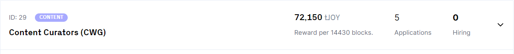
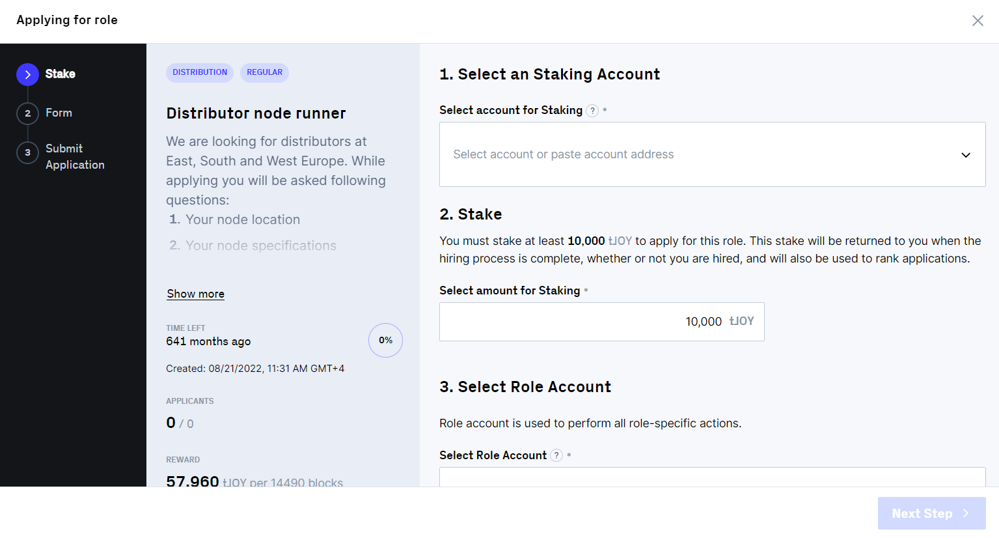
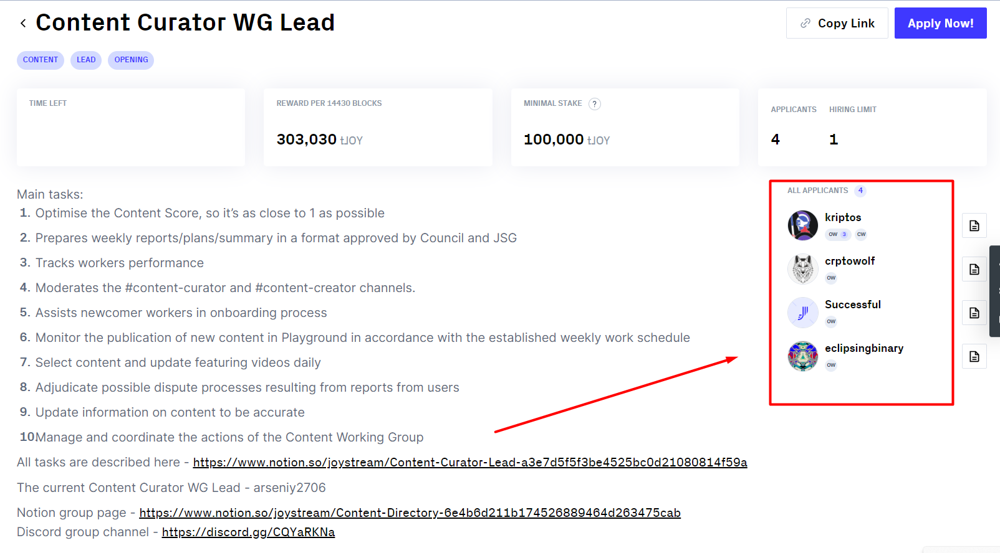

# Tutorial: Apply For Role

Joystream offers a variety of paid positions in working groups, the list of which you can see [here.](https://dao.joystream.org/#/working-groups) You can read the description of groups, choose the one you're interested in, then click on it and see available openings. Alternatively, you can use [this link](https://dao.joystream.org/#/working-groups/openings) to see the full list of openings available on the platform at the moment.&#x20;

Here is an example of an opening:

<figure><figcaption>
Curators opening
</figcaption></figure>

To know the details of an opening, click on it and then click "Learn more". You'll see the description of the role, time left for the opening to expire, rewards you'll get and minimal stake required to apply for this position. If you think you're a suitable candidate, you may apply by clicking "Apply Now!" button, but **** _first you need to prepare your accounts_.

#### 1. Create Polkadot accounts 

As actions related to roles are stored in blockchain, in order to apply for and perform the role you'll need to have 2 Polkadot accounts created specifically for this purpose. To do it, click on your Polkadot extension and then on a "+" button in the upper right corner and **create 2 accounts**. For your convenience, you can name them _"xxx\_staking" and_ "_xxx\_role",_ where xxx is a role you're applying for _(_for example_, "curator\_staking"_ and _"curator\_role")._\
**Staking account** is needed to stake Joys for the chosen position. If you're interested in why staking is required, read about it [here.](https://joystream.gitbook.io/testnet-workspace/system/accounts-and-staking#staking) Staking account will bear the role-specific lock, meaning you will not be able to re-use this account for other purposes, while in the role.\
**Role account** is used to perform all role-specific actions. For example, you'll need it to withdraw your application or to leave the role.&#x20;

#### &#x20;2. Transfer funds to your Staking account&#x20;

You'll need to have some Joy on your Staking account (see the minimum amount in the opening as "Minimum Stake Required"). Go to [this page](https://dao.joystream.org/#/profile), find your Staking account among accounts and click the button "Receive tokens" at the right. Select an account from which you want to transfer tokens, choose the number of tokens and click "Transfer Tokens". A new pop-up window will appear to sign the transaction via Polkadot app, then your tokens will be transfered.

#### 3. Click "Apply Now!" and fill out the form

Now you're ready to fill out the form. Return to the opening page and click "Apply Now!" button. You'll see this pop-up: \

<figure><figcaption>
Working group application form
</figcaption></figure>

As you see on the black left part, you'll need to finish 3 steps. The first one is to specify your staking, role and reward accounts. We've already discussed the first two. As for the reward account, it's the account to which the rewards will be paid and it's usually the same as your controller (main) account. \
The next step is to fill out the application. It's specific for each position and the fields you need to fill out are determined by the Lead of the working group you're applying for. If you have any questions, you can ask him/her in Discord. The Leads are listed [here](https://dao.joystream.org/#/working-groups) at the right. \
The last step is to sign the transaction. Just click "Sign Transaction and Bind Staking Account" button. If everything is right, your application will be submitted and you'll see yourself among applicants on the corresponding opening page.

<figure><figcaption></figcaption></figure>

