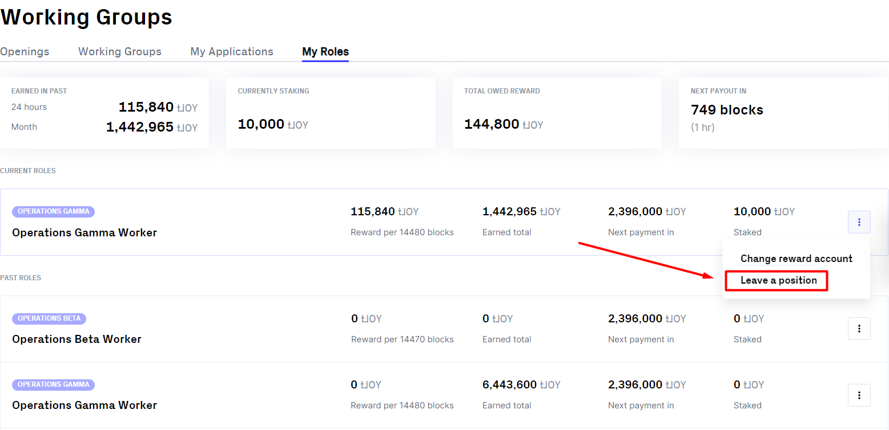
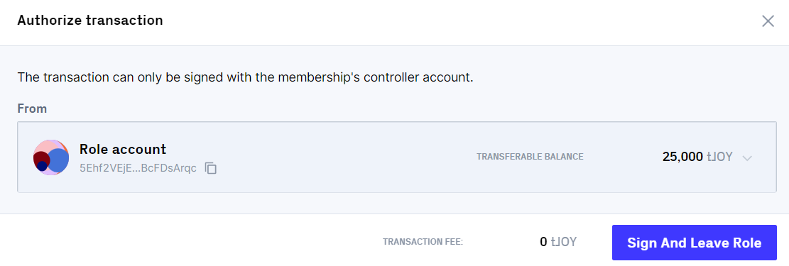

# Tutorial: Leave A Role

#### Getting fired vs leaving the role

There are 2 ways to quit the role: **to be fired** by the Lead (or the Council if you're the Lead) or **to resign** (leave the role yourself). The difference is not only in the actor, but also in the applicability of the unstaking period.\
\
Each opening has a property called `leaving_unstaking_period (the number` of blocks required from a worker initiating leaving the group until their staked funds are unlocked).

* If a Worker/Lead is fired, they leave the role immediately.
* If a Worker/Lead resigns, they will have to wait for this entire period to finish before they actually vacate the position.
* In the case of Leads, this means no new Lead can be hired until the previous Lead has fully left the position.

&#x20;In most cases, if you want to leave the role, you should do it yourself, unless you're fired, and then wait for some time to get back your stake. Unstaking usually takes several days, and you'll continue to get the salary until it's finished.&#x20;

Leaving the role is quite easy, and that's what you need to do:

#### How to leave the role

Go to [this page](https://dao.joystream.org/#/working-groups/my-roles), and you'll see the list of all your roles, current as well as past. To leave the role, click the three-dot button on the right side of the corresponding role. \

<figure><figcaption></figcaption></figure>

Click "Leave a position". A new window will appear, where you'll need to write the reason for your decision. You'll also see the unstaking period length in blocks here, so you can calculate the time it'll take to actually leave the role and get back the stake. Write your reason and if you're sure in your decision, click "Leave The Position Anyway".\
The last step is to authorize the transaction via Polkadot extension.\

<figure><figcaption></figcaption></figure>

Choose your membership's controller account and click "Sign And Leave Role". That's it. \
\
Alternatively, you can leave the role via CLI (Command-Line Interface). In this case, you'll need to write [these commands](https://github.com/Joystream/joystream/tree/master/cli#joystream-cli-working-groupsleaverole) in your terminal.&#x20;
